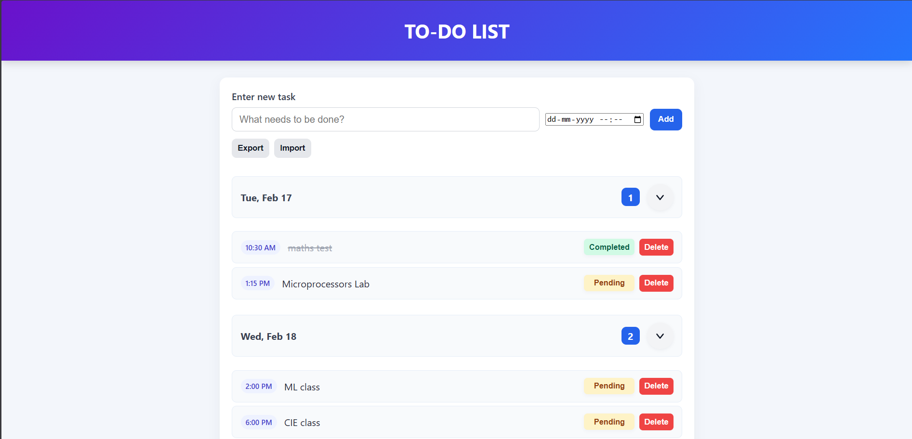

# TO-DO LIST (Task2)

This is a small offline-capable To-Do List web app built with plain HTML/CSS/JavaScript.

**Features**

- Add tasks with an optional due date/time.
- Tasks are grouped by due date (Today, Tomorrow, specific days, Unscheduled).
- Each date group shows a count of uncompleted tasks and a chevron toggle to collapse/expand the group.
- Mark tasks as Completed / Pending.
- Delete tasks.
- Offline persistence via `localStorage` and Export/Import via `tasks.json`.
- Responsive, clean UI with visual indicators for overdue tasks.

**How to run (recommended)**

open `main.html` directly in your browser.

**Usage**

- Enter a task in the input and optionally pick a due date/time, then click `Add` or press Enter.
- Use the yellow `Pending`/green `Completed` pill to toggle task status.
- Use the small blue badge next to each date to see how many tasks remain uncompleted for that date.
- Use `Export` to download `tasks.json` and `Import` to load from a file.

**Files of interest**

- `main.html` — UI markup
- `main.css` — styles
- `main.js` — app logic (tasks stored in `localStorage`)

